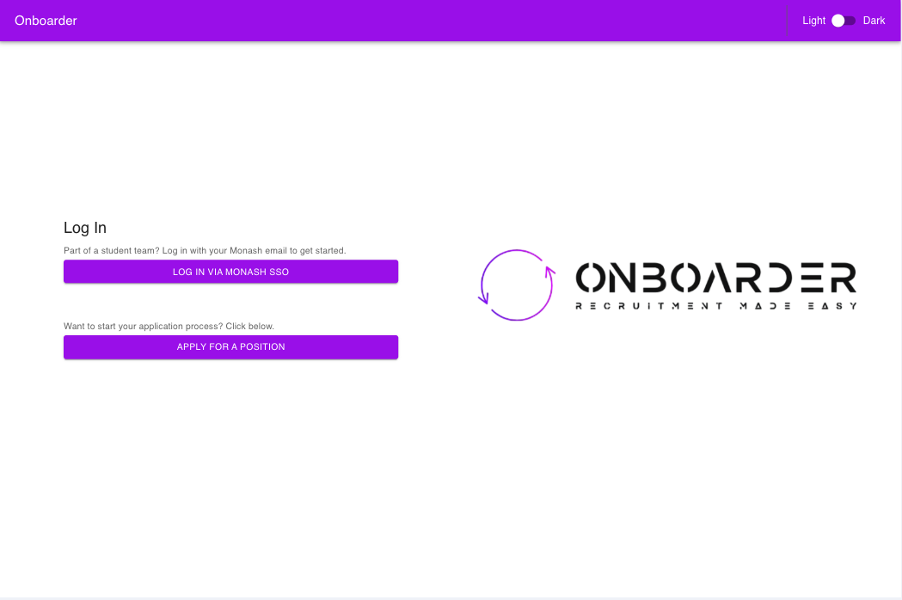

# Onboarder: Student Team Recruitment Platform

Welcome to **Onboarder**, a recruitment platform designed exclusively for Monash University student teams. This application facilitates the recruitment process, enabling team owners, admins, team leads, and applicants to efficiently manage and participate in team recruitment.

## Table of Contents

- [Onboarder: Student Team Recruitment Platform](#onboarder-student-team-recruitment-platform)
  - [Table of Contents](#table-of-contents)
  - [Overview](#overview)
  - [Student Application Stages](#student-application-stages)
  - [Roles and Permissions](#roles-and-permissions)
    - [Team Lead](#team-lead)
    - [Admin](#admin)
    - [Owner](#owner)
    - [Applicant](#applicant)
  - [Monash Authentication](#monash-authentication)
    - [How to Log In](#how-to-log-in)
  - [Features](#features)
  - [Getting Started](#getting-started)
    - [Landing Page](#landing-page)
    - [As a student/applicant](#as-a-studentapplicant)
    - [As a member of a student team](#as-a-member-of-a-student-team)
      - [Owner Example](#owner-example)
      - [Admin Example](#admin-example)
      - [Team Lead Example](#team-lead-example)
  - [Contact](#contact)

---

## Overview

Onboarder is tailored to streamline the recruitment process for Monash University student teams. The platform ensures secure sign on via Monash login and provides different levels of functionality based on user roles such as **Owner**, **Admin**, **Team Lead**, and **Applicant**.

## Student Application Stages

When a student goes through the application, they have 3 stages.

1. Applicant

   - An applicant is a student who has submitted an application.

2. Candidate

   - A candidate is a student whose application has been accepted. This means that they will be interviewed.

3. Recruit

   - A recruit is a student who has completed the interview, and was accepted. The team will sort out further onboarding outside of the application.

4. Rejected

   - If an applicant or candidate is rejected, they are out of the recruitment process.

## Roles and Permissions

Each role in the Onboarder platform has specific access and permissions to interact with the platform.
For each team you are a part of, you will have one of the three roles.

### Team Lead

- **Primary responsibility**: Manages recruitment for specific team openings. They review applications, and conduct interviews.
- **Key actions**:
  - Is invited to team by owner.
  - Is assigned to opening(s) by Owner or Admins.
  - Can review and accept/deny applicants based on their Application
  - Can submit interview feedback for a candidate.
  - Can review and accept/deny candidates who have been interviewed.
  - Can put in availability to conduct interviews
  - Can send emails for candidate to submit their interview availability
  - Can run interview scheduling algorithm
  - Can manually schedule interviews missed by algorithm, or edit the date of interviews scheduled by the algorithm

### Admin

- **Primary responsibility**: Supports the owner in managing the team.
- **Key actions**:
  - Is invited to team by owner
  - Has all permissions of team lead, as well as:
  - Can edit the email configuration for candidates to submit their interview availability
  - Can create recruitment rounds
  - Can open/close/archive recruitment rounds
  - Can create openings for a recruitment round.
  - Can assign team leads (can assign any user to be a team lead for an opening in the team. )

### Owner

- **Primary responsibility**: Manages Team
- **Key actions**:
  - Is the person who created the team.
  - Has all permissions of admin/team lead, as well as:
  - Can edit/delete team
  - Can invite members to the team as admins or team leads
  - Can configure global meeting link for google calendar interview invites.

### Applicant

- **Primary responsibility**: Apply for team openings.
- **Key actions**:
  - Non logged-in user.
  - Browse openings for student teams.
  - Submit applications for desired openings.
  - Can submit interview availability via email link if their application is accepted.
  - Gets sent a google calendar invite if an interview is successfully allocated (and team lead sends the email).

## Monash Authentication

Onboarder uses **Monash University's secure login system** to ensure that only verified Monash students can access the platform. You must use your **Monash student email and password** to log in. This system guarantees that only Monash-affiliated users can participate.

### How to Log In

1. Open the Onboarder platform.
2. Click the **Login with Monash SSO** button.
3. Enter your Monash student credentials when prompted. (If you have not used Onboarder before, it will automatically create an account for you)
4. You will be redirected to the Onboarder dashboard.
5. You can create a student team and become its owner, and see ones you have been invited to as team lead or admin. (More details further down in document)

## Features

- **Monash Authentication**: Secure login via Monash University's authentication system ensures only verified Monash students can access the platform.

- **Role-based Permissions**: The platform offers varying access to features based on user roles, ensuring appropriate access and controls for **Owners**, **Admins**, **Team Leads**, and **Applicants**.

- **Team Creation & Management**: Anyone can go to Onboarder and create a student team

- **Recruitment Rounds**: Owners and Admins of a team can create recruitment rounds for each semester.

- **Openings**: Owners and Admins can create openings within rounds. These represent positions that people can apply for.

- **Applications**: Applicants can explore these openings and submit applications directly through the platform.

- **Application Review Process**: Team leads assigned to an opening, as well as Owners and Admins can review applications, interview candidates, and update the status of applicants throughout the recruitment process.

## Getting Started

### Landing Page

### As a student/applicant

End-to-end example of using the application as a student applying for a role.

- Access the website
- Once on the website, click on `Apply for a position`
- You will be able to see what openings are available for various student teams
- You can view additional info, or click the apply button for an opening.
- Enter your details and click submit button.
- At some point, your application will be reviewed. You will be sent an email if you are rejected.
- If you are accepted, you will be sent an email where you can submit availability preferences for an interview. The team also might send you details for a task to complete before the interview.
- If scheduling is successful, you will be sent a google calendar invite for an interview.
- Attend the interview in person or via meeting link if included.
- After the interview, the team will review all candidates.
- You will be notified if you are successfully accepted as a recruit or not.
- The team will reach out to you via email with further steps.

### As a member of a student team

Here are end-to-end examples of how each role can use the application:

#### Owner Example

- Log into application
- Create a team and add a description.
- Invite some admins.
- (Optional) Add global meeting link for google calendar interview invites.
- Have admins (or yourself) set up rounds and openings. (See below)

#### Admin Example

- Be invited to a team as an admin
- Log into application
- Access the team.
- Create recruitment rounds (E.g. 2025 Semester 1, 2025 Semester 2)
- Create openings for the recruitment rounds. (E.g. add Software Engineer Opening, Engineer Opening, and Marketing Manager Openign to 2025 Semester 1)
- Assign one or more team leads to each opening.
- Open a recruitment round (this means its openings will show on the main page for people to apply to)
- After enough applications are submitted, and interviews are being scheduled, close round.
- After interviews are complete, and some recruits have been hired, archive round.

#### Team Lead Example

- Be invited to a team as a team lead
- Be assigned to one or more openings
- Log into application
- Edit your availability to conduct interviews
- Access team
- Access a round where you have been assigned an opening
- Access an opening
- View applications in the opening.
- Accept some applicants based on their application. (Meaning they become candidates)
- Click button to send interview scheduling email (this will send emails to candidates so that they can put in their availability for interviews)
- Once enough candidates have submitted their preferences, click button to run interview scheduling algorithm.
- Based on the availabilities of the assigned team leads, and the submitted availabilities by candidates, the interview scheduling algorithm will try its best to assign the candidates evenly across the team leads assigned to the opening.
- Each candidate will be assigned an interview date/time, and an interviewer (team lead)
- If the algorithm couldn't allocate all interviews, reach out to the candidates to arrange a time, and manually add it. If you add it, you will be the assigned team lead for that interview.
- Once you are happy with scheduled interviews, click button to send invites.
- This will send out Google Calendar events/invites to each candidate who had an allocated interview time (with the assigned team lead for the interview)
- Conduct interviews in person, or using the link in the google calendar invite (if the owner configured one)
- Use the interview feedback page to score and take notes during the interview.
- After interviews are completed, accept or reject candidates based on their feedback and scores.

To get started with Onboarder, access the website and follow these steps:

Log in with Monash SSO:

- Click the Login with Monash SSO button.

- If you are an Owner or Admin, you can start by setting up your team profile and managing team settings.
  As a Team Lead, create your team's specific recruitment openings.
  As an Applicant, browse the available teams and apply for open positions.
  Start Managing or Applying:

- Owners/Admins: Manage your team settings, assign team leads, and monitor the recruitment process.
  Team Leads: Post new openings, review applicants, and schedule interviews.

## Contact

Please contact the owners of the repo for any questions.
